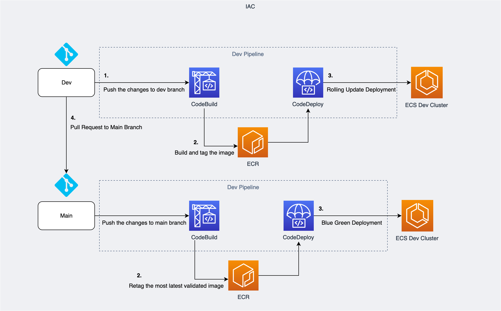

# Terraform ECS CI/CD

This repository is intended to create a full CI/CD pipeline using the Code stack of AWS along with all the foundation that needs to provision the ECS.

**This is a demonstration repository only, you may not use it on production, just use it as reference for your project**

## Repository Structure

```
├── environments
│   └── providers
│       └── aws
│           └── prd
│               ├── apps
│               │   ├── environment.tf
│               │   └── sample-app
│               │       
│               ├── environment.tf
│               └── foundation
│                   
└── modules
    └── aws
        ├── alb
        ├── codebuild
        ├── codedeploy
        ├── codepipeline
        ├── create_sg
        ├── create_sg_rule
        └── ecs
```

**environments:** This folder has the code that is responsible to call the modules, the modules together make a stack.

**environments/providers/aws/prd/foundation:** This folder is where all the foundation IaC stays, it will create the VPC, ECS and ASG.

**environments/providers/aws/prd/apps:** This folder is where all the IaC apps stays, it will create an ECS service, LoadBalancer and Code stack for CI/CD.

**modules:** This is the folder where the modules are stored, so inside this folder we have the Terraform Resources

## Suggested CI/CD Architecture

This architecture is not yet implemented in this IaC, but it is a suggested architecture thinking in Dev and Prod environments.

<p align="center"> 

</p>